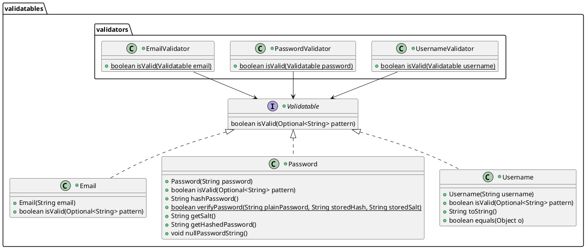

# Refactoring

## Code Smells

[jeweils 1 Code-Beispiel zu 2 unterschiedlichen Code Smells (die benannt werden müssen) aus der
Vorlesung; jeweils Code-Beispiel und einen möglichen Lösungsweg bzw. den genommen Lösungsweg
beschreiben (inkl. (Pseudo-)Code)]

### Code Smell #1: Code Duplication

#### getValidInput Methoden

In jeder Interaction Klasse wurde seperat eine getValidInput Methode geschrieben.

```java
public class CreateDrinkOptionInteraction extends Interaction<DrinkOption> {
    //[...]

    private String getValidInput(StringInput input) {
    while (true) {
        Result<String> result = input.prompt();

        if (result.isHelp()) {
            explain();
            continue;
        }

        if (result.isNone()) {
            System.out.println("Invalid input!");
            continue;
        }

        return result.getValue();
        }
    
    }
}
```

```java
    public class AddRightsInteraction extends Interaction<User> {
        //[...]

        private String getValidInput(StringInput input) {
        while (true) {
            Result<String> result = input.prompt();
            
            if (result.isHelp()) {
                explain();
                continue;
            }
            
            if (result.isNone()) {
                System.out.println("Invalid input!");
                continue;
            }
            
            return result.getValue();
        }
    }
    }
```

#### Lösung: Methode in die Basisklasse verschieben

Alle betroffenen Klassen erben von ```Interaction<T>```, somit kann man sie in die Basisklasse verschieben, von wo sie dann aufgerufen werden kann.


```java
    public abstract class Interaction<T> {
        //[...]

        protected String getValidInput(StringInput input) {
        while (true) {
            Result<String> result = input.prompt();
            
            if (result.isHelp()) {
                explain();
                continue;
            }
            
            if (result.isNone()) {
                System.out.println("Invalid input!");
                continue;
            }
            
            return result.getValue();
            }
        }
        //[...]

    }
```


### Code Smell #2: Method Chains

#### Kontostand ist leer

Wenn geprüft werden soll, ob das Konto eines bestimmten Benutzers leer ist, kann sie durch die folgende Method Chain geprüft werden:

```java
    if (accountDatabase.getAccountOfUser(userDatabase.getUser(username).getUsername()).isEmpty()) {
        //[...]
    }
```

#### Lösung: Funktion/Methode extrahieren/verschieben

Die einzelnen aufgerufenen Methoden können aufgeteilt und in seperaten Funktionen aufgerufen werden. Zusätzlich werden einem Konto seperat ein Benutzername zugeordnet, um die Abhängigkeit von der ```UserDatabase``` zu lösen.

```java
    // In der AccountDatabase Klasse

    public boolean checkIfAccountBalanceIsZero(User user) {
        for (Account a : accounts.get()) {
            if (a.getUsername().equals(user.getUsername()) && a.isEmpty()) {
                return true;
            } 
        }
        return false;
    }
```

## Refactors

[2 unterschiedliche Refactorings aus der Vorlesung jeweils benennen, anwenden, begründen, sowie
UML vorher/nachher liefern; jeweils auf die Commits verweisen – die Refactorings dürfen sich nicht
mit den Beispielen der Code Smells überschneiden]

### Refactor #1: Replace Error Code With Exception

#### User existiert nicht

Die Funktion ```getUser(Username username)``` soll bei Eingabe eines Benutzernamens aus der Benutzerdatenbank einen Benutzer zurückgeben. Wie sollte die Funktion reagieren, wenn der Benutzer nicht gefunden wird?

Ursprüngliche Idee:

```java
public User getUser(Username username) {
        for (User u : users.get()) {
            if (u.getUsername().equals(username)) {
                return u;
            }
        }
        return null;
    }
```

Das zurückgeben eines ```null``` Values kann unvorgesehene Probleme verursachen, wenn das Ergebnis dieser Methode an eine andere weitergegeben wird. Dies hätte zu einem direkten Absturz des Programms geführt.

#### Lösung: Eine UserDoesNotExistException
##### Siehe Commit a348b06325174bb5c331f1a7031786d727bff9bc

Wenn ein Benutzer von einer Datenbank entnommen wird, wird kein null Value als return zurückgegeben, stattdessen eine Custom Exception.

```java
package de.dhbw.karlsruhe.getraenkeabrechnung.data;

public class UserDoesNotExistException extends RuntimeException {
    public UserDoesNotExistException(String message) {
        super(message);
    }
}
```

```java
//Implementation in der UserDatabase Klasse

public User getUser(Username username) {
        for (User u : users.get()) {
            if (u.getUsername().equals(username)) {
                return u;
            }
        }

        throw new UserDoesNotExistException("User with the username " + username + " does not exist!");
    }
```

Falls doch kein Benutzer gefunden wird, kann die Exception gefangen werden und das Programm kann weiterlaufen, ohne vorher abzustürzen.

#### UML davor


#### UML danach


### Refactor #2: Extract Method/Class

#### Die Validator Klassen

Alle Validator für Benutzernamen, Passwörter etc. dienten zur Validierung von Strings. Sie waren alle eigenständige Klassen. Die Klassen, die diese Methoden nutzen wollen, mussten sie einzeln referenzieren. Dies führte zu unübersichtlichen Abhängigkeiten.

#### UML davor (Auswahl)


#### Lösung: Einführen eines gemeinsamen Interfaces
##### Siehe Commit 615ef78145c8b22e15e69c9d2d3cdd3da923a297

Die Validator wurden alle mithilfe eines gemeinsamen Interface ```Validatables``` zusammengefasst. Klassen, die auf diese Validator beruhen, wurden ebenfalls in den Validatables zusammengefasst. Dies führte nichtnur zu einer standardisierten Validierungslogik, sondern auch zu einer verbesserten Codeorganisation mit klaren Methodennamen.

#### UML danach:

