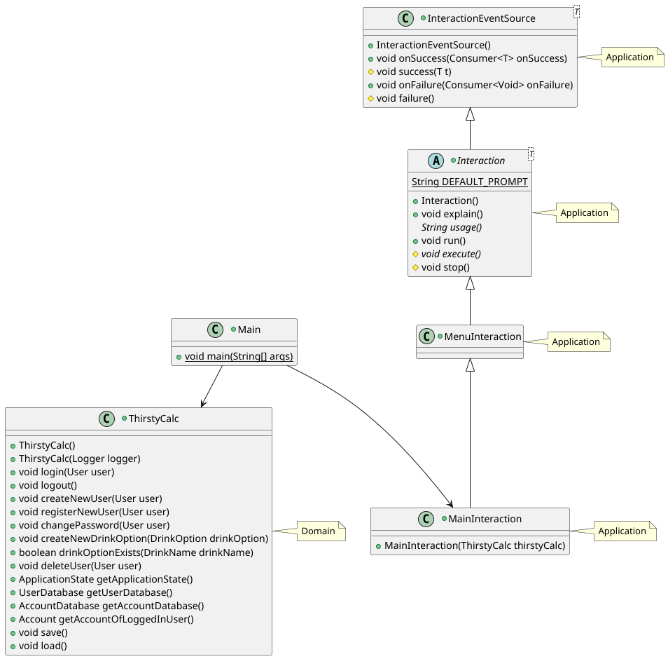
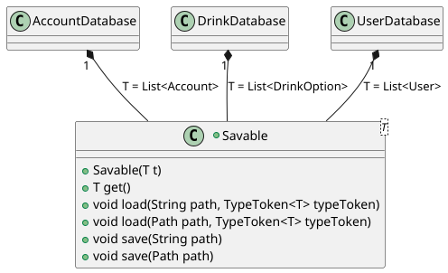

# ThirstyCalc

Paul Bader, Sarah Ficht & Kayra Güler

---


## Einführung (S)

- Übersicht über die Applikation **(1 P.)**
- Starten der Applikation **(1 P.)**
- Technischer Überblick **(2 P.)**

--

### Übersicht

- [ ] Übersicht über die Applikation **(1 P.)**

--

### Starten der Applikation

- [ ] Übersicht über die Applikation **(1 P.)**

--

### Technischer Überblick

- [ ] Übersicht über die Applikation **(1 P.)**


---


## Softwarearchitektur (Paul)

--

### Gewählte Architektur (4P)
- [In der Vorlesung wurden Softwarearchitekturen vorgestellt. Welche Architektur wurde davon
umgesetzt? Analyse und Begründung inkl. UML der wichtigsten Klassen, sowie Einordnung dieser Klassen in die gewählte Architektur]

--

Gewählt wurde die `Clean Architecture`.
Geworden ist es ein `Monolith`.


--

#### Wichtigste Klassen


--

### Domain Code (1P)
- [kurze Erläuterung in eigenen Worten, was Domain Code ist – 1 Beispiel im Code zeigen, das bisher
noch nicht gezeigt wurde]

--

Domaincode ist die Kern-Business-Logik und ist frei von Abhängigkeiten.
Folgender Code ist aus der Klasse `Account.java`:


--

### Analyse der Dependency Rule (3P)
- [In der Vorlesung wurde im Rahmen der ‘Clean Architecture’ die s.g. Dependency Rule vorgestellt. Je 1 Klasse zeigen, die die Dependency Rule einhält und 1 Klasse, die die Dependency Rule verletzt; jeweils UML (mind. die betreffende Klasse inkl. der Klassen, die von ihr abhängen bzw. von der sie abhängt) und Analyse der Abhängigkeiten in beide Richtungen (d.h., von wem hängt die Klasse ab und wer hängt von der Klasse ab) in Bezug auf die Dependency Rule]

--

"Abhängigkeiten immer von außen nach innen"

--

#### Positiv-Beispiel: Dependency Rule


note:
Die Klasse `LoggerFactory` erfüllt hier die Dependency Rule.
Die Klasse `ThirstyCalc` hängt von ihr ab.
Sie ist nicht von einer äußeren Klasse (hier `ThirstyCalc`) abhängig und hängt nur von inneren Klassen (hier `Logger`, allen Implementierungen von `Logger` sowie `LogWriter` und `PrintStreamLogWriter`) ab.

--

#### Negativ-Beispiel: Dependency Rule


note:
Die Klasse `MainInteraction` erfüllt die Dependency Rule nicht.
Die `Main` Klasse ist von `MainInteraction` abhängig.
Die Klasse `MainInteraction` ist von `MenuInteraction` durch Vererbung und von `ExitInteraction`, `LoggedInUserFactory`, `LoginInteraction` und `RegisterUserInteraction` durch Nutzung abhängig.
Die Klasse `ThirstyCalc`, aus einer oberen Schicht in der Clean Architektur, ist ebenfalls eine Abhängigkeit von `MainInteraction`.
Da also eine Klasse aus einer unteren Ebene (`MainInteraction`) von einer aus einer oberen Ebene (`ThirstyCalc`) abhängig ist, ist hier die Dependecy Rule gebrochen. 

---


## SOLID (Paul)

--

### Analyse SRP (3P)
- [jeweils eine Klasse als positives und negatives Beispiel für SRP; jeweils UML und Beschreibung der
Aufgabe bzw. der Aufgaben und möglicher Lösungsweg des Negativ-Beispiels (inkl. UML)]

--

#### Positiv-Beispiel
Die Klasse `InputReader` hat die einzige Aufgabe, eine Eingabezeile aus einem `InputStream` zu lesen.


--

#### Negativ-Beispiel


note:
Die Klasse `AccountDatabase` hat hier mehrere Aufgaben.
Zum einen ist sie für die Erstellung, Persistierung und Löschung von `Account`s zuständig, zum anderen hat sie auch die Funktionalität mit `checkIfAccountBalanceIsZero(User user)`, ob die `Balance` eines `Account` 0 ist.

--

Eine mögliche Lösung, um das SRP für `AccountDatabase` umzusetzen, ist im folgenden UML-Diagram dargestellt:


note:
Hier wurde die Geschäftslogik, die den `User` betrifft in die Klasse `UserAccountService` ausgelagert.
Die Klasse `AccountDatabase` ist somit lediglich für Hinzufügen, Entfernen und Persistieren der `Account`s verantworlich.

--

### Analyse OCP (3P)
- [jeweils eine Klasse als positives und negatives Beispiel für OCP; jeweils UML und Analyse mit Begründung, warum das OCP erfüllt/nicht erfüllt wurde – falls erfüllt: warum hier sinnvoll/welches Problem gab es? Falls nicht erfüllt: wie könnte man es lösen (inkl. UML)?]

--

#### Positiv-Beispiel


note:
Das Interface `Logger` erfüllt hier das OCP.
Es können mehrere Implementierungen des `Logger` Interface implementiert werden, ohne, dass deren Aufrufer angepasst werden müssen.
Warum wurde das hier umgesetzt?
Die Logs sollen unterschiedlich sein, je nachdem, ob ein Benutzer eingeloggt ist oder nicht.
Die Klasse `ThirstyCalc`, welche von `Logger` und `LoggerFactory` abhängig ist, ruft bei jedem Log nur die `log(String message)` Methode vom `Logger` Interface auf.
Wenn sich ein Benutzer einloggt, wird der `Logger` in ThirstyCalc durch eine Instanz des `UserLogger` ersetzt und somit sind die Logs dann auf den `User` bezogen.

--

#### Negativ-Beispiel


note:
Die Klasse `AdminRights` erfüllt hier nicht OCP.
Wenn man eine neue Benutzerkategorie einführen möchte, müsste man auch das die Aufrufer von `AdminRights` anpassen, um an den benötigten Stellen dann die anderen Rechte zu verteilen.

--

#### Lösung für das Negativ-Beispiel


note:
Eine Lösung ist die Abstraktion zu einem `RightsGiver` Interface.
Dadurch können neue Rechtegruppen erstellt werden, ohne, dass die Aufrufer von `RightsGiver` angepasst werden müssen.

--

### Analyse [LSP/ISP/DIP] (2P)
- [jeweils eine Klasse als positives und negatives Beispiel für entweder LSP oder ISP oder DIP; jeweils UML und Begründung, warum hier das Prinzip erfüllt/nicht erfüllt wird; beim Negativ-Beispiel UML einer möglichen Lösung hinzufügen]

- [Anm.: es darf nur ein Prinzip ausgewählt werden; es darf NICHT z.B. ein positives Beispiel für LSP und ein negatives Beispiel für ISP genommen werden]

--

#### Positiv-Beispiel: LSP


note:
Die Klasse `Interaction` realisiert das LSP (Liskov Substitution Principle).
Jede Implementierung der `Interaction` (z.B. `StringInputInteraction` oder `MenuInteraction`) kann an jeder beliebigen Stelle von `Interaction` benutzt werden, ohne, dass unerwünschte Nebeneffekte auftreten.

--

#### Negativ-Beispiel: LSP


note:
Die `LogWriterLoggerAdapter` Klasse kann hier einen unerwünschten Nebeneffekt haben:
Beim Aufruf auf `getInnerLogger()` gibt sie sich selbst zurück.
Wenn eine Klasse also rekursiv die inneren Logger von den Loggern abruft, kommt es zu einem Stackoverflow.

--

#### Lösung für das Negativ-Beispiel: LSP


note:
Eine Lösung ist das Interface `Logger` in zwei Interfaces zu teilen.
Jetzt muss die Klasse `LogWriterLoggerAdapter` nicht mehr die Methode `getInnerLogger()` implementieren und somit ist der unerwünschte Nebeneffekt behoben.

---


## Weitere Prinzipien (Paul)

--

### Analyse GRASP: Geringe Kopplung (3P)
- [eine bis jetzt noch nicht behandelte Klasse als positives Beispiel geringer Kopplung; UML mit zusammenspielenden Klassen, Aufgabenbeschreibung der Klasse und Begründung, warum hier eine geringe Kopplung vorliegt; es müssen auch die Aufrufer/Nutzer der Klasse berücksichtigt werden]

--


note:
Die Klasse `InteractionEventSource` realisiert die geringe Kopplung von GRASP.
Durch das hier verwendete Listener Pattern (durch die Methoden `onSuccess(Consumer<T> onSuccess)` und `onFailure(Consumer<Void> onFailure)`)

--

### Analyse GRASP: [Polymorphismus/Pure Fabrication] (3P)
- [eine Klasse als positives Beispiel entweder von Polymorphismus oder von Pure Fabrication; UML
Diagramm und Begründung, warum es hier zum Einsatz kommt]

--

#### Polymorphismus


note:
Die Klasse `Savable` setzt Polymorphismus durch Generics um.
Die Klasse kapselt die Funktionalität der De-/Serialisierung und des Ladens und Speicherns von Daten.
Da für diese Funktionalität nicht relevant ist, welche Art von Objekt behandelt wird, ist die Klasse generisch gehalten.
Somit können mehrere Objekttypen durch die gleiche Klasse verarbeitet werden (hier `List<Account`, `List<User>`, `List<DrinkOption>`).

--

### DRY (2P)
- [ein Commit angeben, bei dem duplizierter Code/duplizierte Logik aufgelöst wurde; Code-Beispiele (vorher/nachher) einfügen; begründen und Auswirkung beschreiben – ggf. UML zum Verständnis ergänzen]

--

[git commit: 7050c4c57c00a0a52a48088c0a997e9fa2e227af](https://github.com/Puggingtons/Getraenkeabrechnung/commit/7050c4c57c00a0a52a48088c0a997e9fa2e227af)

--

#### Vorher


note:
Die unterschiedlichen Spezifizierungen der `Input` Klasse (hier `NumberInput` und `StringInput`) hatten das selbe Verhalten bei der Ausführung eines Prompts. Sie unterschieden sich lediglich beim Erstellen des `Results`.

--

#### Nachher


note:
Das übereinstimmende Verhalten wurde in die Elternklasse `Input` ausgelagert und die Stelle, die sich bei den Kindklassen unterschieden hat durch eine neue abstrakte Methode `getResult(String input)` ersetzt.
Diese implementieren die Kindklassen nun.
Somit haben sie weiterhin das selbe Verhalten, der Code wurde aber dedupliziert.

--

#### Code-Diff


--


--


---


## Unit Tests (S)

- 10 Unit Tests **(2 P.)**
- ATRIP: Automatic, Thorough und Professional **(2 P.)**
- Fakes und Mocks **(4 P.)**

--

### 10 Unit Tests

- [Zeigen und Beschreiben von 10 Unit-Tests und Beschreibung, was getestet wird] **(2 P.)**

--

### ATRIP

- ATRIP: Automatic, Thorough und Professional (2P)
[je Begründung/Erläuterung, wie ‘Automatic’, ‘Thorough’ und ‘Professional’ realisiert wurde – bei
‘Thorough’ zusätzlich Analyse und Bewertung zur Testabdeckung]

--

### Automatic

- [Begründung/Erläuterung, wie ‘Automatic’ realisiert wurde]
    + alles wird in IDE auf einmal ausgeführt zum individuellen testing vor push / pr in main
    + pipeline führt bei jedem merge in main branch die tests aus

--


### Thorough
- [Code Coverage im Projekt analysieren und begründen]
    + SonarQubeCloud bietet Übersicht über Codecoverage spezifisch für lines und branches

--

### Professional
- [1 positves Beispiel zu ‘Professional’; Code-Beispiel, Analyse und Begründung, was professionell ist]
- Arrange-Act-Assert Pattern: Durch Branchabdeckung werden Randfälle aufgedeckt

--


### Fakes und Mocks

- [Analyse und Begründung des Einsatzes von 2 Fake/Mock-Objekten (die Fake/Mocks sind ohne Dritthersteller-Bibliothek/Framework zu implementieren)]
- Zeigen der Implementierung und Nutzung; zusätzlich jeweils UML Diagramm mit
Beziehungen zwischen Mock, zu mockender Klasse und Aufrufer des Mocks]


---


## Domain Driven Design (S)

- Ubiquitous Language **(2 P.)**
- Repositories **(1,5 P.)**
- Aggregates **(1,5 P.)**
- Entities **(1,5 P.)**
- Value Objects **(1.5 P.)**

--

### Ubiquitous Language

- Ubiquitous Language: gemeinsame, strenge Sprache zwischen Entwicklern und Benutzern, basierend auf dem Domänenmodell.
- Ziel ist es, Mehrdeutigkeiten zu minimieren und die Kommunikation und das Verständnis zwischen allen am Softwareentwicklungsprozess Beteiligten zu verbessern.

--


- Bezeichnung
- Bedeutung
- Begründung

--

### Repositories

- [UML, Beschreibung und Begründung des Einsatzes eines Repositories; falls kein Repository
vorhanden: ausführliche Begründung, warum es keines geben kann/hier nicht sinnvoll ist – NICHT,
warum es nicht implementiert wurde]

--

### Aggregates

- [UML, Beschreibung und Begründung des Einsatzes eines Aggregates; falls kein Aggregate
vorhanden: ausführliche Begründung, warum es keines geben kann/hier nicht sinnvoll ist– NICHT,
warum es nicht implementiert wurde]

--

### Entities

- [UML, Beschreibung und Begründung des Einsatzes einer Entity; falls keine Entity vorhanden:
ausführliche Begründung, warum es keine geben kann/hier nicht sinnvoll ist– NICHT, warum es nicht
implementiert wurde]

--

### Value Objects

- [UML, Beschreibung und Begründung des Einsatzes eines Value Objects; falls kein Value Object
vorhanden: ausführliche Begründung, warum es keines geben kann/hier nicht sinnvoll ist– NICHT,
warum es nicht implementiert wurde]

---


## Refactoring

--

### Code Smells

- jeweils 1 Code-Beispiel zu 2 unterschiedlichen Code Smells (die benannt werden müssen) aus der
Vorlesung; jeweils Code-Beispiel und einen möglichen Lösungsweg bzw. den genommen Lösungsweg
beschreiben (inkl. (Pseudo-)Code)

--

### Code Smell #1: Code Duplication
#### getValidInput Methoden

In jeder Interaction Klasse wurde seperat eine getValidInput Methode geschrieben.

--


--


--

### Lösung: Methode in die Basisklasse verschieben

Alle betroffenen Klassen erben von ```Interaction<T>```, somit kann man sie in die Basisklasse verschieben, von wo sie dann aufgerufen werden kann.

--


--

### Code Smell #2: Method Chains

#### Kontostand ist leer

Wenn geprüft werden soll, ob das Konto eines bestimmten Benutzers leer ist, kann sie durch die folgende Method Chain geprüft werden:


--

### Lösung: Funktion/Methode extrahieren/verschieben

Die einzelnen aufgerufenen Methoden können aufgeteilt und in seperaten Funktionen aufgerufen werden. Zusätzlich werden einem Konto seperat ein Benutzername zugeordnet, um die Abhängigkeit von der ```UserDatabase``` zu lösen.

--


--

## Refactors

- 2 unterschiedliche Refactorings aus der Vorlesung jeweils benennen, anwenden, begründen, sowie
UML vorher/nachher liefern; jeweils auf die Commits verweisen – die Refactorings dürfen sich nicht
mit den Beispielen der Code Smells überschneiden

--

### Refactor #1: Replace Error Code With Exception

#### User existiert nicht

Die Funktion ```getUser(Username username)``` soll bei Eingabe eines Benutzernamens aus der Benutzerdatenbank einen Benutzer zurückgeben. Wie sollte die Funktion reagieren, wenn der Benutzer nicht gefunden wird?

--

Ursprüngliche Idee:


--

Das zurückgeben eines ```null``` Values kann unvorgesehene Probleme verursachen, wenn das Ergebnis dieser Methode an eine andere weitergegeben wird. Dies hätte zu einem direkten Absturz des Programms geführt.

--

#### Lösung: Eine UserDoesNotExistException
##### Siehe Commit a348b06325174bb5c331f1a7031786d727bff9bc

Wenn ein Benutzer von einer Datenbank entnommen wird, wird kein null Value als return zurückgegeben, stattdessen eine Custom Exception.

--


--


--

Falls doch kein Benutzer gefunden wird, kann die Exception gefangen werden und das Programm kann weiterlaufen, ohne vorher abzustürzen.

--

#### UML davor


--

#### UML danach


--

### Refactor #2: Extract Method/Class

#### Die Validator Klassen

Alle Validator für Benutzernamen, Passwörter etc. dienten zur Validierung von Strings. Sie waren alle eigenständige Klassen. Die Klassen, die diese Methoden nutzen wollen, mussten sie einzeln referenzieren. Dies führte zu unübersichtlichen Abhängigkeiten.

--

#### UML davor (Auswahl)


--

#### Lösung: Einführen eines gemeinsamen Interfaces
##### Siehe Commit 615ef78145c8b22e15e69c9d2d3cdd3da923a297

Die Validator wurden alle mithilfe eines gemeinsamen Interface ```Validatables``` zusammengefasst. Klassen, die auf diese Validator beruhen, wurden ebenfalls in den ```Validatables``` zusammengefasst. Dies führte nicht nur zu einer standardisierten Validierungslogik, sondern auch zu einer verbesserten Codeorganisation mit klaren Methodennamen.

--

#### UML danach:


---

## Entwurfsmuster

--

- 2 unterschiedliche Entwurfsmuster aus der Vorlesung (oder nach Absprache auch andere) jeweils
benennen, sinnvoll einsetzen, begründen und UML-Diagramm

--

## Entwurfsmuster #1: Adapter 

Adapter ermöglichen die Zusammenarbeit von Klassen, dessen Schnittstellen eigentlich nicht kompatibel sind.

--

### LogWriterLoggerAdapter

#### UML (vereinfacht)


--

- Der Hauptzweck des ```LogWriterLoggerAdapter``` ist es, einen ```LogWriter``` als ```Logger``` verwenden zu können, da beide Klassen seperate Aufgaben besitzen.

--

- Das ```Logger``` Interface ist für das aufsammeln der Aktivitäten innerhalb der Anwendung da, während der ```LogWriter``` für das Schreiben der eigentlichen Logeinträge in Dateien zuständig ist.

--

- Durch den Adapter ist es möglich, dass Code, der mit der ```Logger```-Schnittstelle arbeitet, einen ```LogWriter``` zu übergeben, damit z.b. die gesammelten Logs in einer Datei gespeichert werden können.

--

## Entwurfsmuster #2: Decorator

Decorator sind eine Art Strukturmuster, die es ermöglichen, Objekten dynamisch zusätzliche Funktionalitäten hinzuzufügen, ohne deren Struktur zu verändern.

--

### Das Logger-System


--

- Das ```Logger``` Interface definiert die Grundoperationen, die jeder Logger unterstützen muss. Die ```getInnerLogger()``` Methode ermöglicht den Zugriff auf den eingewickelten Logger.

--

- Die konkreten Decorator-Klassen hier sind die ```TimeLogger```, ```UserLogger``` und ```ClassLogger```. Sie fügen den Logeinträgen jeweils einen Zeitstempel, Benutzerinformationen und Klassennamen hinzu.

--

- Mithilfe der ```LoggerFactory``` können die verschiedenen Decorator-Klassen flexibel kombiniert werden.

--


---


# Vielen Dank für die Aufmerksamkeit
