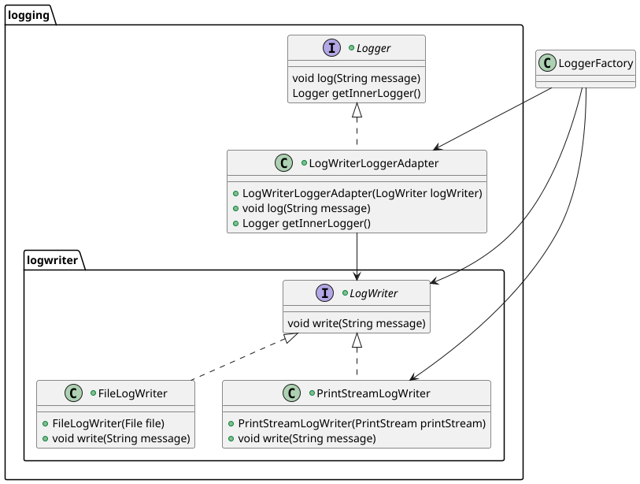
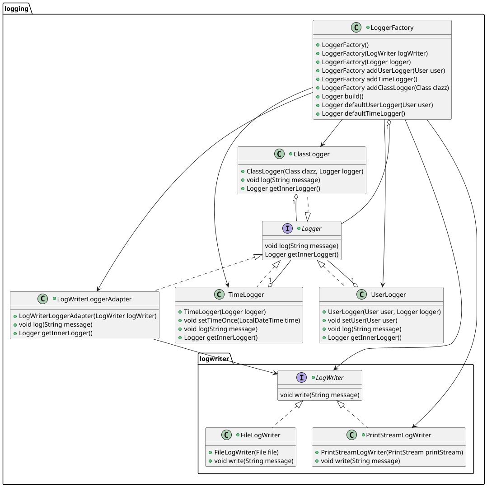

# ThirstyCalc

Paul Bader, Sarah Ficht & Kayra Güler

---


## Einführung (S)

- Übersicht über die Applikation **(1 P.)**
- Starten der Applikation **(1 P.)**
- Technischer Überblick **(2 P.)**

--

### Übersicht

- [ ] Übersicht über die Applikation **(1 P.)**

--

### Starten der Applikation

- [ ] Übersicht über die Applikation **(1 P.)**

--

### Technischer Überblick

- [ ] Übersicht über die Applikation **(1 P.)**


---


## Softwarearchitektur (Paul)

- [ ] 2\. Softwarearchitektur **(8 P.)**
    - [ ] Gewählte Architektur **(4 P.)**
    - [ ] Domain Code **(1 P.)**
    - [ ] Analyse der Dependency Rule **(3 P.)**
        - [ ] Positiv-Beispiel
        - [ ] Negativ-Beispiel

---


## SOLID (Paul)

- [ ] 3\. SOLID **(8 P.)**
    - [ ] Analyse SRP **(3 P.)**
        - [ ] Positiv-Beispiel
        - [ ] Negativ-Beispiel
    - [ ] Analyse OCP **(3 P.)**
        - [ ] Positiv-Beispiel
        - [ ] Negativ-Beispiel
    - [ ] Analyse [LSP/ISP/DIP] **(2 P.)**
        - [ ] Positiv-Beispiel
        - [ ] Negativ-Beispiel

---


## Weitere Prinzipien (Paul)

- [ ] 4\. Weitere Prinzipien **(8 P.)**
    - [ ] Analyse GRASP: Geringe Kopplung **(3 P.)**
    - [ ] Analyse GRASP: [Polymophismus/Pure Fabrication] **(3 P.)**
    - [ ] DRY **(2 P.)**

---


## Unit Tests (S)

- 10 Unit Tests **(2 P.)**
- ATRIP: Automatic, Thorough und Professional **(2 P.)**
- Fakes und Mocks **(4 P.)**

--

### 10 Unit Tests

- [Zeigen und Beschreiben von 10 Unit-Tests und Beschreibung, was getestet wird] **(2 P.)**

--

### ATRIP

- ATRIP: Automatic, Thorough und Professional (2P)
[je Begründung/Erläuterung, wie ‘Automatic’, ‘Thorough’ und ‘Professional’ realisiert wurde – bei
‘Thorough’ zusätzlich Analyse und Bewertung zur Testabdeckung]

--

### Automatic

- [Begründung/Erläuterung, wie ‘Automatic’ realisiert wurde]
    + alles wird in IDE auf einmal ausgeführt zum individuellen testing vor push / pr in main
    + pipeline führt bei jedem merge in main branch die tests aus

--


### Thorough
- [Code Coverage im Projekt analysieren und begründen]
    + SonarQubeCloud bietet Übersicht über Codecoverage spezifisch für lines und branches

--

### Professional
- [1 positves Beispiel zu ‘Professional’; Code-Beispiel, Analyse und Begründung, was professionell ist]
- Arrange-Act-Assert Pattern: Durch Branchabdeckung werden Randfälle aufgedeckt

--


### Fakes und Mocks

- [Analyse und Begründung des Einsatzes von 2 Fake/Mock-Objekten (die Fake/Mocks sind ohne Dritthersteller-Bibliothek/Framework zu implementieren)]
- Zeigen der Implementierung und Nutzung; zusätzlich jeweils UML Diagramm mit
Beziehungen zwischen Mock, zu mockender Klasse und Aufrufer des Mocks]


---


## Domain Driven Design (S)

- Ubiquitous Language **(2 P.)**
- Repositories **(1,5 P.)**
- Aggregates **(1,5 P.)**
- Entities **(1,5 P.)**
- Value Objects **(1.5 P.)**

--

### Ubiquitous Language

- Ubiquitous Language: gemeinsame, strenge Sprache zwischen Entwicklern und Benutzern, basierend auf dem Domänenmodell.
- Ziel ist es, Mehrdeutigkeiten zu minimieren und die Kommunikation und das Verständnis zwischen allen am Softwareentwicklungsprozess Beteiligten zu verbessern.

--


- Bezeichnung
- Bedeutung
- Begründung

--

### Repositories

- [UML, Beschreibung und Begründung des Einsatzes eines Repositories; falls kein Repository
vorhanden: ausführliche Begründung, warum es keines geben kann/hier nicht sinnvoll ist – NICHT,
warum es nicht implementiert wurde]

--

### Aggregates

- [UML, Beschreibung und Begründung des Einsatzes eines Aggregates; falls kein Aggregate
vorhanden: ausführliche Begründung, warum es keines geben kann/hier nicht sinnvoll ist– NICHT,
warum es nicht implementiert wurde]

--

### Entities

- [UML, Beschreibung und Begründung des Einsatzes einer Entity; falls keine Entity vorhanden:
ausführliche Begründung, warum es keine geben kann/hier nicht sinnvoll ist– NICHT, warum es nicht
implementiert wurde]

--

### Value Objects

- [UML, Beschreibung und Begründung des Einsatzes eines Value Objects; falls kein Value Object
vorhanden: ausführliche Begründung, warum es keines geben kann/hier nicht sinnvoll ist– NICHT,
warum es nicht implementiert wurde]

---


## Refactoring

--

### Code Smells

- jeweils 1 Code-Beispiel zu 2 unterschiedlichen Code Smells (die benannt werden müssen) aus der
Vorlesung; jeweils Code-Beispiel und einen möglichen Lösungsweg bzw. den genommen Lösungsweg
beschreiben (inkl. (Pseudo-)Code)

--

### Code Smell #1: Code Duplication
#### getValidInput Methoden

In jeder Interaction Klasse wurde seperat eine getValidInput Methode geschrieben.

--


--


--

### Lösung: Methode in die Basisklasse verschieben

Alle betroffenen Klassen erben von ```Interaction<T>```, somit kann man sie in die Basisklasse verschieben, von wo sie dann aufgerufen werden kann.

--


--

### Code Smell #2: Method Chains

#### Kontostand ist leer

Wenn geprüft werden soll, ob das Konto eines bestimmten Benutzers leer ist, kann sie durch die folgende Method Chain geprüft werden:


--

### Lösung: Funktion/Methode extrahieren/verschieben

Die einzelnen aufgerufenen Methoden können aufgeteilt und in seperaten Funktionen aufgerufen werden. Zusätzlich werden einem Konto seperat ein Benutzername zugeordnet, um die Abhängigkeit von der ```UserDatabase``` zu lösen.

--


--

## Refactors

- 2 unterschiedliche Refactorings aus der Vorlesung jeweils benennen, anwenden, begründen, sowie
UML vorher/nachher liefern; jeweils auf die Commits verweisen – die Refactorings dürfen sich nicht
mit den Beispielen der Code Smells überschneiden

--

### Refactor #1: Replace Error Code With Exception

#### User existiert nicht

Die Funktion ```getUser(Username username)``` soll bei Eingabe eines Benutzernamens aus der Benutzerdatenbank einen Benutzer zurückgeben. Wie sollte die Funktion reagieren, wenn der Benutzer nicht gefunden wird?

--

Ursprüngliche Idee:


--

Das zurückgeben eines ```null``` Values kann unvorgesehene Probleme verursachen, wenn das Ergebnis dieser Methode an eine andere weitergegeben wird. Dies hätte zu einem direkten Absturz des Programms geführt.

--

#### Lösung: Eine UserDoesNotExistException
##### Siehe Commit a348b06325174bb5c331f1a7031786d727bff9bc

Wenn ein Benutzer von einer Datenbank entnommen wird, wird kein null Value als return zurückgegeben, stattdessen eine Custom Exception.

--


--


--

Falls doch kein Benutzer gefunden wird, kann die Exception gefangen werden und das Programm kann weiterlaufen, ohne vorher abzustürzen.

--

#### UML davor


--

#### UML danach


--

### Refactor #2: Extract Method/Class

#### Die Validator Klassen

Alle Validator für Benutzernamen, Passwörter etc. dienten zur Validierung von Strings. Sie waren alle eigenständige Klassen. Die Klassen, die diese Methoden nutzen wollen, mussten sie einzeln referenzieren. Dies führte zu unübersichtlichen Abhängigkeiten.

--

#### UML davor (Auswahl)


--

#### Lösung: Einführen eines gemeinsamen Interfaces
##### Siehe Commit 615ef78145c8b22e15e69c9d2d3cdd3da923a297

Die Validator wurden alle mithilfe eines gemeinsamen Interface ```Validatables``` zusammengefasst. Klassen, die auf diese Validator beruhen, wurden ebenfalls in den ```Validatables``` zusammengefasst. Dies führte nicht nur zu einer standardisierten Validierungslogik, sondern auch zu einer verbesserten Codeorganisation mit klaren Methodennamen.

--

#### UML danach:


---

## Entwurfsmuster

--

- 2 unterschiedliche Entwurfsmuster aus der Vorlesung (oder nach Absprache auch andere) jeweils
benennen, sinnvoll einsetzen, begründen und UML-Diagramm

--

## Entwurfsmuster #1: Adapter 

Adapter ermöglichen die Zusammenarbeit von Klassen, dessen Schnittstellen eigentlich nicht kompatibel sind.

--

### LogWriterLoggerAdapter

#### UML (vereinfacht)



--

- Der Hauptzweck des ```LogWriterLoggerAdapter``` ist es, einen ```LogWriter``` als ```Logger``` verwenden zu können, da beide Klassen seperate Aufgaben besitzen.

--

- Das ```Logger``` Interface ist für das aufsammeln der Aktivitäten innerhalb der Anwendung da, während der ```LogWriter``` für das Schreiben der eigentlichen Logeinträge in Dateien zuständig ist.

--

- Durch den Adapter ist es möglich, dass Code, der mit der ```Logger```-Schnittstelle arbeitet, einen ```LogWriter``` zu übergeben, damit z.b. die gesammelten Logs in einer Datei gespeichert werden können.

--

## Entwurfsmuster #2: Decorator

Decorator sind eine Art Strukturmuster, die es ermöglichen, Objekten dynamisch zusätzliche Funktionalitäten hinzuzufügen, ohne deren Struktur zu verändern.

--

### Das Logger-System



--

- Das ```Logger``` Interface definiert die Grundoperationen, die jeder Logger unterstützen muss. Die ```getInnerLogger()``` Methode ermöglicht den Zugriff auf den eingewickelten Logger.

--

- Die konkreten Decorator-Klassen hier sind die ```TimeLogger```, ```UserLogger``` und ```ClassLogger```. Sie fügen den Logeinträgen jeweils einen Zeitstempel, Benutzerinformationen und Klassennamen hinzu.

--

- Mithilfe der ```LoggerFactory``` können die verschiedenen Decorator-Klassen flexibel kombiniert werden.

--


---


# Vielen Dank für die Aufmerksamkeit
