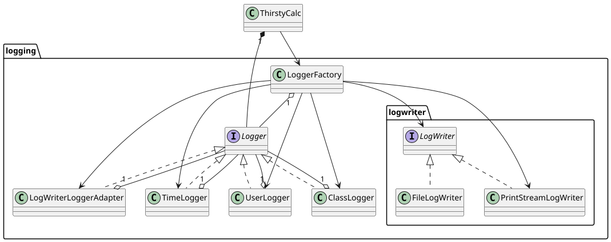
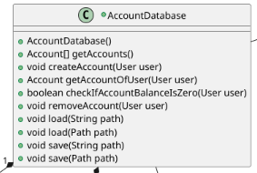
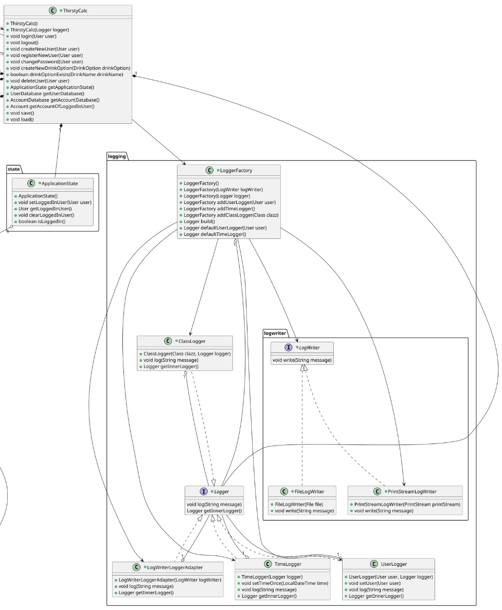

# Programmentwurf - Protokoll
[Bezeichung]

Name: [Name, Vorname]

Martrikelnummer: [MNR]

Abgabedatum: [DATUM]

Allgemeine Anmerkungen:
- Gesamt-Punktzahl: 60P (zum Bestehen mit 4,0 werden 30P benötigt)
- die Aufgabenbeschreibung (der blaue Text) und die mögliche Punktanzahl muss im Dokument
erhalten bleiben
- es darf nicht auf andere Kapitel als alleiniger Leistungsnachweis verwiesen werden (z.B. in der Form “XY wurde schon in Kapitel 2 behandelt, daher hier keine Ausführung”)
- alles muss in UTF-8 codiert sein (Text und Code)
- das Dokument muss als PDF abgegeben werden
- es gibt keine mündlichen Nebenabreden / Ausnahmen – alles muss so bearbeitet werden, wie es schriftlich gefordert ist
- alles muss ins Repository (Code, Ausarbeitung und alles was damit zusammenhängt)
- die Beispiele sollten wenn möglich vom aktuellen Stand genommen werden
    - finden sich dort keine entsprechenden Beispiele, dürfen auch ältere Commits unter Verweis
auf den Commit verwendet werden
    - Ausnahme: beim Kapitel “Refactoring” darf von vorne herein aus allen Ständen frei
gewählt werden (mit Verweis auf den entsprechenden Commit)
- falls verlangte Negativ-Beispiele nicht vorhanden sind, müssen entsprechend mehr PositivBeispiele gebracht werden
    - Achtung: werden im Code entsprechende Negativ-Beispiele gefunden, gibt es keine  Punkte für die zusätzlichen Positiv-Beispiele sondern 0,5P Abzug für das fehlende  Negativ-Beispiel
    - Beispiel
        - “Nennen Sie jeweils eine Klasse, die das SRP einhält bzw. verletzt.” (2P)
            - Antwort: Es gibt keine Klasse, die SRP verletzt, daher hier 2 Klassen, die SRP einhalten: [Klasse 1], [Klasse 2]
            - Bewertung: falls im Code tatsächlich keine Klasse das SRP verletzt: 2P ODER falls im Code mind. eine Klasse SRP verletzt: 1P
- verlangte Positiv-Beispiele müssen gebracht werden – im Zweifel müssen sie extra für die Lösung der Aufgabe implementiert werden
- Code-Beispiel = Code aus dem Projekkt in das Dokument kopieren (inkl. Syntax-Highlighting)
- falls Bezug auf den Code genommen wird: entsprechende Code-Teile in das Dokument kopieren (inkl Syntax-Highlighting)
- bei UML-Diagrammen immer die öffentlichen Methoden und Felder angegeben – private  Methoden/Felder nur angeben, wenn sie zur Klärung beitragen
- bei UML-Diagrammen immer unaufgefordert die zusammenspielenden Klassen ergänzen, falls  diese Teil der Aufgabe sind
- Klassennamen/Variablennamen/etc im Dokument so benennen, wie sie im Code benannt sind (z.B. im Dokument nicht anfangen, englische Klassennamen zu übersetzen)
- die Aufgaben sind von vorne herein bekannt und müssen wie gefordert gelöst werden – z.B. ist es keine Lösung zu schreiben, dass es das nicht im Code gibt
    - Beispiel 1
        - Aufgabe: Analyse und Begründung des Einsatzes von 2 Fake/Mock-Objekten
        - Antwort: Es wurden keine Fake/Mock-Objekte gebraucht.
        - Punkte: 0P
    - Beispiel 2
        - Aufgabe: UML, Beschreibung und Begründung des Einsatzes eines Repositories
        - Antwort: Die Applikation enthält kein Repository
        - Punkte
            - falls (was quasi nie vorkommt) die Fachlichkeit tatsächlich kein Repository hergibt: volle Punktzahl
            - falls die Fachlichkeit in irgendeiner Form ein Repository hergibt (auch wenn es  nicht implementiert wurde): 0P
    - Beispiel 3
        - Aufgabe: UML von 2 implementierte unterschiedliche Entwurfsmuster aus der Vorlesung
        - Antwort: es wurden keine Entwurfsmuster gebraucht/implementiert
        - Punkt: 0P
- es dürfen nicht mehr Beispiele etc. angegeben werden als verlangt – sollte das doch der Fall
sein, wird nur das erste Beispiel bewertet und die folgenden kommentarlos gestrichen
    - Beispiel
        - Frage: Nennen Sie 1 Klasse, die SRP erfüllt (1P)
        - Antwort: Die Klasse “User” und “Appointment” erfüllen SRP.
        - Bewertung: falls die Klasse “User” SRP erfüllt: 1P. Falls nicht: 0P. Die weiter  angegebene Klasse “Appointment” wird nicht bewertet, da nur nach einer Klasse  gefragt wurde

## Kapitel 1: Einführung (4P)
### Übersicht über die Applikation (1P)
[Was macht die Applikation? Wie funktioniert sie? Welches Problem löst sie/welchen Zweck hat sie?]
### Starten der Applikation (1P)
[Wie startet man die Applikation? Was für Voraussetzungen werden benötigt? Schritt-für-SchrittAnleitung]
### Technischer Überblick (2P)
[Nennung und Erläuterung der Technologien (z.B. Java, MySQL, …), jeweils Begründung für den Einsatz der Technologien]

---

## Kapitel 2: Softwarearchitektur (8P)
### Gewählte Architektur (4P)
[In der Vorlesung wurden Softwarearchitekturen vorgestellt. Welche Architektur wurde davon
umgesetzt? Analyse und Begründung inkl. UML der wichtigsten Klassen, sowie Einordnung dieser Klassen in die gewählte Architektur]

Gewählt wurde die `Clean Architecture`.
Geworden ist es ein `Monolith`.

### Domain Code (1P)
[kurze Erläuterung in eigenen Worten, was Domain Code ist – 1 Beispiel im Code zeigen, das bisher
noch nicht gezeigt wurde]

Domaincode ist die Kern-Business-Logik und ist frei von Abhängigkeiten.
Folgender Code ist aus der Klasse `Account.java`:
```java
public void deposit(Money amount) {
    balance = balance.add(amount);
}

public Money charge(Money amount) throws NotEnoughMoneyException {
    if (amount.getAmount().compareTo(balance.getAmount()) > 0) {
        throw new NotEnoughMoneyException("Not enough money in account! (available: " + balance + ", charged: " + amount + ")");
    }

    balance = balance.subtract(amount);
    return amount;
}
```

### Analyse der Dependency Rule (3P)
[In der Vorlesung wurde im Rahmen der ‘Clean Architecture’ die s.g. Dependency Rule vorgestellt. Je 1 Klasse zeigen, die die Dependency Rule einhält und 1 Klasse, die die Dependency Rule verletzt; jeweils UML (mind. die betreffende Klasse inkl. der Klassen, die von ihr abhängen bzw. von der sie abhängt) und Analyse der Abhängigkeiten in beide Richtungen (d.h., von wem hängt die Klasse ab und wer hängt von der Klasse ab) in Bezug auf die Dependency Rule]

"Abhängigkeiten immer von außen nach innen"

#### Positiv-Beispiel: Dependency Rule
Die Klasse `LoggerFactory` erfüllt hier die Dependency Rule.
Die Klasse `ThirstyCalc` hängt von ihr ab.
Sie ist nicht von einer äußeren Klasse (hier `ThirstyCalc`) abhängig und hängt nur von inneren Klassen (hier `Logger`, allen Implementierungen von `Logger` sowie `LogWriter` und `PrintStreamLogWriter`) ab.


#### Negativ-Beispiel: Dependency Rule
Die Klasse `MainInteraction` erfüllt die Dependency Rule nicht.
Die `Main` Klasse ist von `MainInteraction` abhängig.
Die Klasse `MainInteraction` ist von `MenuInteraction` durch Vererbung und von `ExitInteraction`, `LoggedInUserFactory`, `LoginInteraction` und `RegisterUserInteraction` durch Nutzung abhängig.
Die Klasse `ThirstyCalc`, aus einer oberen Schicht in der Clean Architektur, ist ebenfalls eine Abhängigkeit von `MainInteraction`.
Da also eine Klasse aus einer unteren Ebene (`MainInteraction`) von einer aus einer oberen Ebene (`ThirstyCalc`) abhängig ist, ist hier die Dependecy Rule gebrochen. 


---

## Kapitel 3: SOLID (8P)
### Analyse SRP (3P)
[jeweils eine Klasse als positives und negatives Beispiel für SRP; jeweils UML und Beschreibung der
Aufgabe bzw. der Aufgaben und möglicher Lösungsweg des Negativ-Beispiels (inkl. UML)]
#### Positiv-Beispiel
Die Klasse `InputReader` hat die einzige Aufgabe, eine Eingabezeile aus einem `InputStream` zu lesen.


#### Negativ-Beispiel
Die Klasse `AccountDatabase` hat hier mehrere Responsibilities.
Zum einen ist sie für die Erstellung, Persistierung und Löschung von `Account`s zuständig, zum anderen hat sie auch die Funktionalität mit `checkIfAccountBalanceIsZero(User user)`, ob die `Balance` eines `Account` 0 ist.



Eine mögliche Lösung, um das SRP für `AccountDatabase` umzusetzen, ist im folgenden UML-Diagram dargestellt:


Hier wurde die Geschäftslogik, die den `User` betrifft in die Klasse `UserAccountService` ausgelagert.
Die Klasse `AccountDatabase` ist somit lediglich für Hinzufügen, Entfernen und Persistieren der `Account`s verantworlich.

### Analyse OCP (3P)
[jeweils eine Klasse als positives und negatives Beispiel für OCP; jeweils UML und Analyse mit Begründung, warum das OCP erfüllt/nicht erfüllt wurde – falls erfüllt: warum hier sinnvoll/welches Problem gab es? Falls nicht erfüllt: wie könnte man es lösen (inkl. UML)?]
#### Positiv-Beispiel
Das Interface `Logger` erfüllt hier das OCP.
Es können mehrere Implementierungen des `Logger` Interface implementiert werden, ohne, dass deren Aufrufer angepasst werden müssen.

Warum wurde das hier umgesetzt?
Die Logs sollen unterschiedlich sein, je nachdem, ob ein Benutzer eingeloggt ist oder nicht.
Die Klasse `ThirstyCalc`, welche von `Logger` und `LoggerFactory` abhängig ist, ruft bei jedem Log nur die `log(String message)` Methode vom `Logger` Interface auf.
Wenn sich ein Benutzer einloggt, wird der `Logger` in ThirstyCalc durch eine Instanz des `UserLogger` ersetzt und somit sind die Logs dann auf den `User` bezogen.



#### Negativ-Beispiel
### Analyse [LSP/ISP/DIP] (2P)
[jeweils eine Klasse als positives und negatives Beispiel für entweder LSP oder ISP oder DIP; jeweils UML und Begründung, warum hier das Prinzip erfüllt/nicht erfüllt wird; beim Negativ-Beispiel UML einer möglichen Lösung hinzufügen]

[Anm.: es darf nur ein Prinzip ausgewählt werden; es darf NICHT z.B. ein positives Beispiel für LSP und ein negatives Beispiel für ISP genommen werden]
#### Positiv-Beispiel
#### Negativ-Beispiel

---

## Kapitel 4: Weitere Prinzipien (8P)
### Analyse GRASP: Geringe Kopplung (3P)
[eine bis jetzt noch nicht behandelte Klasse als positives Beispiel geringer Kopplung; UML mit zusammenspielenden Klassen, Aufgabenbeschreibung der Klasse und Begründung, warum hier eine geringe Kopplung vorliegt; es müssen auch die Aufrufer/Nutzer der Klasse berücksichtigt werden]
### Analyse GRASP: [Polymorphismus/Pure Fabrication] (3P)
[eine Klasse als positives Beispiel entweder von Polymorphismus oder von Pure Fabrication; UML
Diagramm und Begründung, warum es hier zum Einsatz kommt]
### DRY (2P)
[ein Commit angeben, bei dem duplizierter Code/duplizierte Logik aufgelöst wurde; Code-Beispiele (vorher/nachher) einfügen; begründen und Auswirkung beschreiben – ggf. UML zum Verständnis ergänzen]

---

## Kapitel 5: Unit Tests (8P)
### 10 Unit Tests (2P)
[Zeigen und Beschreiben von 10 Unit-Tests und Beschreibung, was getestet wird]
### ATRIP: Automatic, Thorough und Professional (2P)
[je Begründung/Erläuterung, wie ‘Automatic’, ‘Thorough’ und ‘Professional’ realisiert wurde – bei ‘Thorough’ zusätzlich Analyse und Bewertung zur Testabdeckung]
### Fakes und Mocks (4P)
[Analyse und Begründung des Einsatzes von 2 Fake/Mock-Objekten (die Fake/Mocks sind ohne
Dritthersteller-Bibliothek/Framework zu implementieren); zusätzlich jeweils UML Diagramm mit
Beziehungen zwischen Mock, zu mockender Klasse und Aufrufer des Mocks]

---

## Kapitel 6: Domain Driven Design (8P)
### Ubiquitous Language (2P)
[4 Beispiele für die Ubiquitous Language; jeweils Bezeichung, Bedeutung und kurze Begründung, warum es zur Ubiquitous Language gehört]
Bezeichung Bedeutung Begründung
### Repositories (1,5P)
[UML, Beschreibung und Begründung des Einsatzes eines Repositories; falls kein Repository vorhanden: ausführliche Begründung, warum es keines geben kann/hier nicht sinnvoll ist – NICHT, warum es nicht implementiert wurde]
### Aggregates (1,5P)
[UML, Beschreibung und Begründung des Einsatzes eines Aggregates; falls kein Aggregate
vorhanden: ausführliche Begründung, warum es keines geben kann/hier nicht sinnvoll ist– NICHT,
warum es nicht implementiert wurde]
### Entities (1,5P)
[UML, Beschreibung und Begründung des Einsatzes einer Entity; falls keine Entity vorhanden:
ausführliche Begründung, warum es keine geben kann/hier nicht sinnvoll ist– NICHT, warum es nicht
implementiert wurde]
### Value Objects (1,5P)
[UML, Beschreibung und Begründung des Einsatzes eines Value Objects; falls kein Value Object
vorhanden: ausführliche Begründung, warum es keines geben kann/hier nicht sinnvoll ist– NICHT,
warum es nicht implementiert wurde]

---

## Kapitel 7: Refactoring (8P)
### Code Smells (2P)
[jeweils 1 Code-Beispiel zu 2 unterschiedlichen Code Smells (die benannt werden müssen) aus der Vorlesung; jeweils Code-Beispiel und einen möglichen Lösungsweg bzw. den genommen Lösungsweg beschreiben (inkl. (Pseudo-)Code)]
#### [CODE SMELL 1]
#### [CODE SMELL 2]
### 2 Refactorings (6P)
[2 unterschiedliche Refactorings aus der Vorlesung jeweils benennen, anwenden, begründen, sowie UML vorher/nachher liefern; jeweils auf die Commits verweisen – die Refactorings dürfen sich nicht mit den Beispielen der Code überschneiden]

---

## Kapitel 8: Entwurfsmuster (8P)
[2 unterschiedliche Entwurfsmuster aus der Vorlesung (oder nach Absprache auch andere) jeweils
benennen, sinnvoll einsetzen, begründen und UML-Diagramm]
### Entwurfsmuster: [Name] (4P)
### Entwurfsmuster: [Name] (4P)